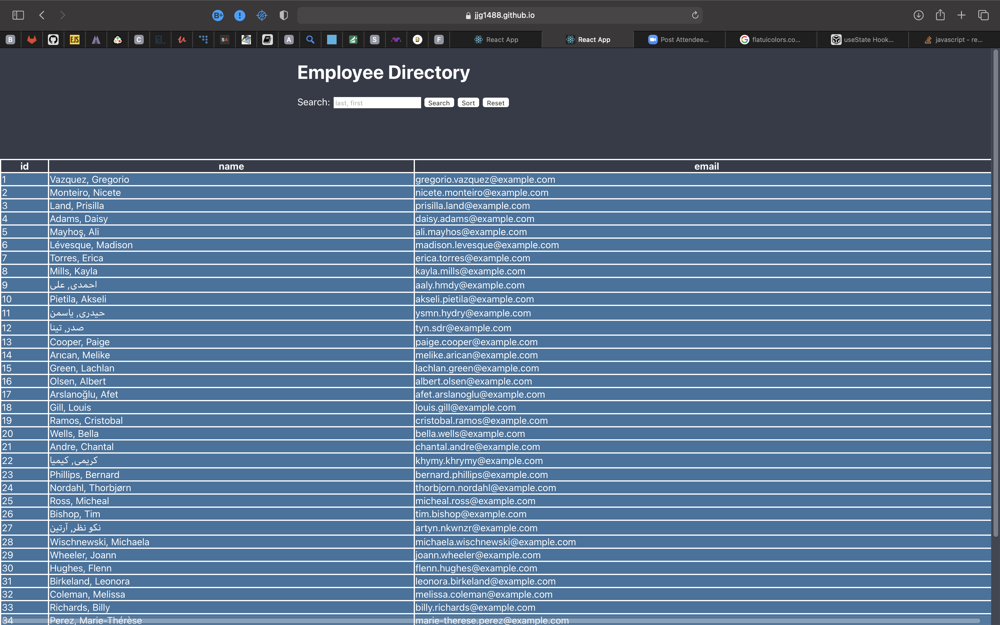

## employee-directory-application

# Description

This app shows how react compartmentalizes components and manages state while responding to user events

---

# Preview

![Link] (<https://https://employeedirectory-app.herokuapp.com>)

---

## Table of Contents

[Description of Application](#description)

[How to Install](#installation)

[How to Use](#usage)

[License Coverage](#license)

[How to Contribute](#contributing)

[How to Run Tests](#tests)

[Contact Information](#questions)
    
---

# Installation

Fork the repository over and run npm i in the ide of your choice. Run npm start after the dependencies have been loaded and the application will show in your deefault browser

---

 # Usage

Sort, Search and reset the employee list as the results show on the screen

---

# License

---

# Contributing

Contact me via email

---

# Questions

jamesgault1488@gmail.com

JJG1488

Contact me via email or github

